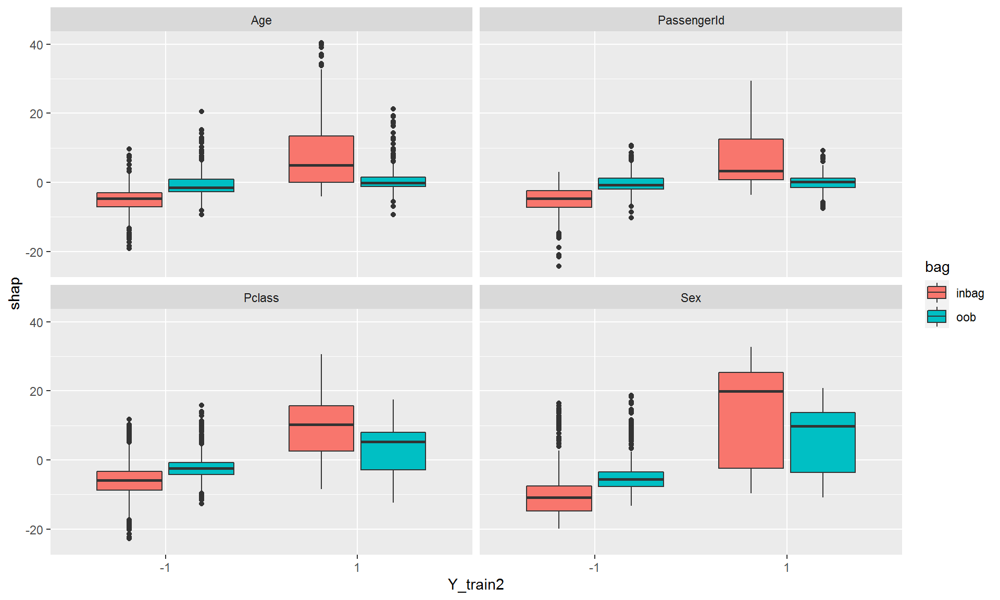

# "Supervised SHAP" {#Supervised_SHAP}

```{r, echo=FALSE}
showCode = FALSE
```

The signal-to-noise separation for the SHAP values is moderate but can be greatly improved by mutliplying with $y_i$ before averaging, as shown in Figure \@ref(fig:shap-wghted-fig).

```{r shap-wghted-fig, fig.cap='Weighted SHAP values, as explained in the text. Left graph: power study, where only $X_2$ is informative. Right graph: null case, where none of the predictor variables is informative. Other simulation details as before.', fig.width=10, echo=FALSE}

```

## Motivation

Why multiply by Y ? 

I believe that ultimately the misleading feature importances are an overfitting problem. The global importance scores are averages of the **absolute values** of the SHAP values, so they reflect merely variation; regardless whether that variation reflects the truth at all. 

So for e.g. passengerID the model will still produce widely varying SHAP values even on a testset (or oob) -leading to inflated importance - but we would want to "penalize" the wrong direction! 
(Not possible on the training data as the model was fit in order to optimize the agreement with $Y_{train}$).

Figure \@ref(fig:weighted-shap-titanic-fig) shows the results for the Titanic data:

```{r weighted-shap-titanic-fig, fig.cap='Left graph: raw SHAP values for  the Titanic data, separately computed for inbag and OOB.  Right graph: weighted SHAP values are multiplied by $y_i$ before averaging which eliminates the spurious contributions due to \textit{passengerID} for OOB. Note that we scaled the SHAP values to their respective maxima for easier comparison.', fig.width=20,echo=FALSE}

```

For the inbag data we observe a strong correlation between the sign of the SHAP vales and the sign of $Y_{train}$, whereas this gap disappears almost entirely for those features that suffer from overfitting (such as passenger ID):

```{r shap-titanic-inbag-oob-boxplots-fig, fig.cap='The difference in SHAP distributions the sign of $Y_{train}$ is greatest for informative features.', fig.width=20,echo=FALSE}

```

## in-outbag correlations


For new data, multiplying by Y will not be feasible anyhow, so we need to look for other ways of correcting the SHAP values.

Figure \@ref(fig:inbag-oob-correlations-fig) suggests that the correlation between inbag and oob SHAP values is an indicator for the degree of overfitting. MSE or $R^2$ (or some other measure of goodness of fit) could be used as an indicator for the reliability of the importance measures.

```{r inbag-oob-correlations-fig, fig.cap='The correlation between inbag and oob SHAP values is greatest for informative features.', fig.width=20,echo=FALSE}

```

## Debias Proposals


```{r, echo=FALSE}
library(ggplot2)

load("data/shap_SHAP_TitanicRegV3.rda")
```

For each feature

* Fit a (linear?) model $SHAP_{i, oob} = \beta_1 \cdot SHAP_{i, inbag} + u_i$
* Use the estimates $\widehat{SHAP}_{i, oob} = \hat{\beta_1} \cdot SHAP_{i, inbag}$ as local explanations instead of either $SHAP_{i, oob}$ or $SHAP_{i, inbag}$,

We can think of the predictions as a "regularized" or "smoothed" version of the original SHAP values.
The "shrinkage" depends on the correlation between inbag and oob:

### Shrunk SHAP for Titanic {.unlisted .unnumbered}

For the simple case of the Titanic data, the "smoothing" of the SHAP values looks promising.

```{r, fig.width = 10, echo=showCode}

shap_oob_avg_hat = shap_oob_avg

for (j in 1:4){
  fit = lm(shap_oob_avg[,j] ~ shap_inbag_avg[,j] - 1)
  shap_oob_avg_hat[,j] = fit$fitted.values
}
par(mfrow=c(1,3))
boxplot(shap_inbag_avg, col = "darkred", main = "inbag", ylab = "SHAP");grid()
boxplot(shap_oob_avg, col = "darkblue", main = "oob");grid()
boxplot(shap_oob_avg_hat, col = "darkgreen", main = "oob smoothed");grid()
```


### Shrunk SHAP for Simulated Data {.unlisted .unnumbered}

However, for the simulated data much less so. (Then again, there is definit improvements)

```{r, echo=FALSE}
load("data/Simulation1_null.rda")
load("data/Simulation1_power.rda")
```

#### NULL simulation {.unlisted .unnumbered}

```{r, fig.width = 10, echo=showCode}

shap_avs_oob0_hat = shap_avs_oob0

for (j in 1:4){
  fit = lm(shap_avs_oob0[,j] ~ shap_avs_in0[,j] - 1)
  shap_avs_oob0_hat[,j] = fit$fitted.values
}
par(mfrow=c(1,3))
boxplot(shap_avs_in0, col = "darkred", main = "inbag", ylab = "SHAP");grid()
boxplot(shap_avs_oob0, col = "darkblue", main = "oob");grid()
boxplot(shap_avs_oob0_hat, col = "darkgreen", main = "oob smoothed");grid()
```


#### Power simulation {.unlisted .unnumbered}

```{r, fig.width = 10, echo=showCode}

shap_avs_oob_hat = shap_avs_oob

for (j in 1:4){
  fit = lm(shap_avs_oob[,j] ~ shap_avs_in[,j] - 1)
  shap_avs_oob_hat[,j] = fit$fitted.values
}
par(mfrow=c(1,3))
boxplot(shap_avs_in, col = "darkred", main = "inbag", ylab = "SHAP");grid()
boxplot(shap_avs_oob, col = "darkblue", main = "oob");grid()
boxplot(shap_avs_oob_hat, col = "darkgreen", main = "oob smoothed");grid()
```

I feel that 

* the signal-to-noise ratio of the simulated data is low 
* we might want to tune the model first
* we might need the equivalent of a global F test (for the Null simulation case)